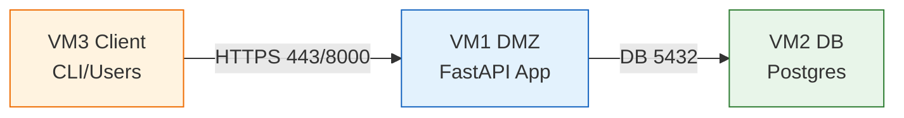
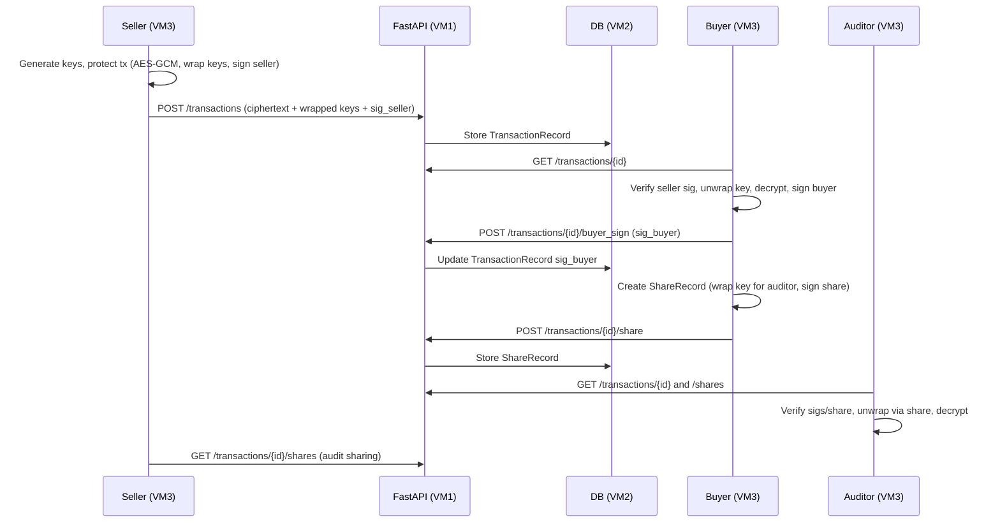

# ChainOfProduct Technical Report

## 1. Overview
ChainOfProduct (CoP) is a minimal prototype for secure Delivery-vs-Payment (DvP) transactions stored on an untrusted server while preserving confidentiality, authenticity, integrity, and auditability of shares. Payloads are encrypted client-side; the server stores ciphertext, wrapped keys, and signatures only.

## 2. Crypto design (algorithms and rationale)
- **Symmetric encryption:** AES-256-GCM per transaction (`crypto.encrypt_aes_gcm`). Provides confidentiality and authenticity (SR1/SR3).
- **Per-recipient key wrapping:** X25519 ECDH to derive a shared secret, HKDF-SHA256 to derive a wrap key, then AES-GCM to wrap the transaction key (`crypto.wrap_key` / `unwrap_key`). Ensures only intended parties unwrap the symmetric key (SR1).
- **Signatures:** Ed25519 for:
  - Seller signature over `hash_T` (SHA-256 of canonical JSON).
  - Buyer signature over the same `hash_T`.
  - ShareRecord signature over hash of share fields. Guarantees authenticity and integrity (SR2/SR3/SR4).
- **Hashing:** SHA-256 (`crypto.hash_bytes`) to bind signatures to canonical JSON and share records.

## 3. Data model
- **TransactionRecord** (server): ciphertext, tag, nonce, ek_map (company → wrapped key), hash_T, sig_seller, sig_buyer, metadata.
- **ShareRecord** (server): id, tx_id, from_company, to_company, ek_to, timestamp, sig_share.
- **Company** (server): name, signing_public, encryption_public (for reference/auditing).

## 4. Network architecture (3-VM split)
- **VM1 (DMZ)**: FastAPI app server. Exposed to clients over HTTPS (TCP 443 or 8000 for dev). Talks to DB only.
- **VM2 (Internal DB)**: Postgres (or SQLite in dev). Accessible only from VM1 on DB port (e.g., 5432).
- **VM3 (Client)**: Runs CLI/clients; reaches VM1 over HTTPS. No direct DB access.

**Mermaid network diagram**

**Firewall rules**
- Client → DMZ: allow 443 (or 8000 dev); deny everything else.
- DMZ → DB: allow 5432 from VM1 to VM2; deny other inbound/outbound to DB.
- DB: no internet/client exposure.

**TLS**
- Terminate TLS on VM1 (uvicorn `--ssl-keyfile/--ssl-certfile` or behind nginx/HAProxy). Use internal CA or self-signed for prototype. Optionally enable DB TLS internally.

## 5. Sequence (end-to-end)

## 6. Component responsibilities
- **chainofproduct/crypto.py:** wrappers for AES-GCM, Ed25519, X25519+HKDF wrapping, base64 helpers.
- **chainofproduct/library.py:** protect, buyer_sign, check, unprotect, create_share_record; canonical JSON hashing.
- **chainofproduct/keymanager.py:** dummy key generation/loading (PEM stored base64 in JSON).
- **app/main.py, models.py, db.py:** FastAPI API, SQLAlchemy models, DB bootstrap.
- **clients/**: seller/buyer/auditor demo flows using API + library.
- **scripts/**: VM run scripts for DMZ app, DB, and client flows.

## 7. How the system works (SR1–SR4)
- **SR1 Confidentiality:** Payload encrypted with AES-GCM. Symmetric key wrapped per party with X25519+AES-GCM; server never sees plaintext or unwrapped keys.
- **SR2 Authentication:** Ed25519 signatures by seller/buyer over the transaction hash; only holders of signing keys can produce valid signatures. ShareRecords signed by the disclosing party.
- **SR3 Integrity:** Signatures cover SHA-256 of canonical JSON; AES-GCM tag covers ciphertext and AAD (hash_T). Tampering breaks verification/decryption.
- **SR4 Auditability:** ShareRecords stored server-side with signatures. Seller/buyer can fetch `/transactions/{tx_id}/shares`, verify `sig_share`, and see who received access.

## 8. Running on 3 Kali VMs (quick steps)
- **VM2 (DB):** `sudo apt install docker.io && sudo bash scripts/vm2_db.sh` (bind Postgres locally; firewall restrict to VM1).
- **VM1 (DMZ app):** `export COP_DB_URL=postgresql+psycopg2://cop:cop@<vm2-ip>:5432/cop && bash scripts/vm1_dmz_app.sh` (front with HTTPS in prod).
- **VM3 (Clients):**
  - Seller terminal: `bash scripts/vm3_seller.sh API=http://<vm1-ip>:8000`
  - Buyer terminal: `bash scripts/vm3_buyer.sh API=http://<vm1-ip>:8000`
  - Auditor (optional): `bash scripts/vm3_auditor.sh API=http://<vm1-ip>:8000`

These scripts generate keys if missing, protect/upload tx, buyer verifies/signs/shares, auditor decrypts via share, and you can fetch shares for audit.

## 9. Validation and logging
- Run `pytest -vv -s --capture=no tests/test_crypto.py tests/test_flow.py` to see colored step-by-step output.
- Observe API logs (uvicorn) for endpoint calls; DB contents show only ciphertext/wrapped keys/signatures.

## 10. Extensibility notes
- Swap dummy keymanager with real PKI/KEK service.
- Replace X25519 with KMS-based wrapping if required.
- Add TLS enforcement, JWT/API auth on endpoints, and audit logging.
- Support multi-party wrapping by extending `ek_map` and share logic.
